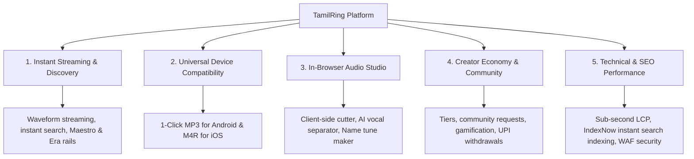

# 🎯 TamilRing — Product Vision, Purpose & Mission

> **"Transforming the chaotic, spam-ridden ringtone download experience into a modern, lightning-fast audio discovery platform and browser-based audio studio for Tamil music lovers worldwide."**

---

## 1. Executive Summary & Elevator Pitch

**TamilRing** is a high-performance web platform designed to modernize how Tamil cinema music, background scores (BGM), dialogues, and devotional tracks are discovered, personalized, and set as phone ringtones.

Built with **Next.js 16 (App Router)**, **React 19**, and **Tailwind CSS v4**, TamilRing removes the popups, deceptive ads, and broken links of legacy download portals. Instead, it offers **1-tap dual-format downloads (`.mp3` for Android & `.m4r` for iPhone)**, real-time waveform streaming, an **in-browser Web Audio & AI studio**, and an active creator community.

---

## 2. Why Are We Creating It? (The Problems We Are Solving)

### 🚫 1. The "Old Web" Ringtone Nightmare
* **The Problem:** The traditional ringtone download ecosystem in India is infamous for aggressive pop-under ads, deceptive "Download" buttons that trick users into downloading malicious APKs, stale links, and slow speeds.
* **Our Solution:** A clean, ad-safe, Spotify-grade user experience with instant waveform playback, dark mode aesthetics, zero intrusive redirect loops, and transparent 1-click downloads.

### 🍏 2. The Android vs. iPhone (`.m4r`) Friction
* **The Problem:** Setting custom ringtones on iOS has always been difficult compared to Android. Android devices natively take `.mp3`, while iPhones require `.m4r` file formats or GarageBand routing.
* **Our Solution:** Automated dual-format generation on every track (`.mp3` and `.m4r`), accompanied by clear, device-detected on-screen setup walkthroughs for iPhone users.

### 🎶 3. Tamil Music Needs Cultural Taxonomy
* **The Problem:** Mainstream international music platforms organize tracks strictly by generic western genres. Tamil listeners, however, connect with music based on:
  * **Legendary Maestros:** Ilaiyaraaja, A.R. Rahman, Yuvan Shankar Raja, Harris Jayaraj, Anirudh, Vidyasagar.
  * **Cinematic Eras:** 80s Golden Classics, 90s Melodies, 2000s Nostalgia, 2020s Mass BGMs.
  * **Moods & Deviations:** Mass elevation punch dialogues, breakup/sad violin themes, high-energy intros, and folk beats.
  * **Bhakthi & Spiritual:** Deity-specific collections (Lord Murugan, Lord Shiva, Amman, Lord Krishna).
* **Our Solution:** A deeply cataloged, culturally attuned taxonomy that mirrors how Tamil audiences naturally search, share, and reminisce.

### ✂️ 4. Eliminating Shady Utility Apps (In-Browser Studio)
* **The Problem:** Trimming an MP3 or isolating vocals usually requires users to install privacy-invasive apps from the Play Store or upload their personal files to untrusted cloud servers.
* **Our Solution:** An in-browser Web Audio and AI suite (`/tools`):
  * **MP3 Cutter:** Trim, fade, and export audio client-side using the Web Audio API without uploading files.
  * **AI Vocal Remover:** Separate vocals and instruments locally in the browser via WebAssembly & ONNX.
  * **Name Ringtone Maker:** Generate personalized Tamil caller tunes by merging names with iconic movie background scores.

### 👥 5. Empowering Creators with Recognition & Rewards
* **The Problem:** Thousands of passionate fans manually crop, master, and share ringtones on Telegram and WhatsApp groups with zero credit or reward.
* **Our Solution:** A community gamification system featuring user progression tiers (*Listener → Creator → Composer → Maestro → Legend*), upload approvals, badges, and UPI payouts for verified contributors.

---

## 3. Core Product Pillars

| Pillar | Primary Benefit |
| :--- | :--- |
| **Instant Discovery** | Instant audio playback with zero lag, persistent bottom dock, and search-as-you-type. |
| **Universal Compatibility** | Frictionless dual exports (`.mp3` for Android, `.m4r` for iPhone). |
| **Browser Studio (`/tools`)** | Audio trimmer, vocal separation, and custom name ringtone generator directly on device. |
| **Community Driven** | User requests, curated uploads, safe-harbor copyright compliance, and creator rewards. |
| **Speed & Edge Delivery** | Sub-second load times, instant Google/Bing IndexNow submissions, and structured rich snippets. |

---

## 4. Target Audience

1. **Kollywood & Tamil Music Enthusiasts:** Looking for the latest mass BGM or nostalgic 90s melodies to personalize their phones.
2. **iPhone Users:** Seeking simple `.m4r` downloads without convoluted iTunes sync steps.
3. **Global Tamil Diaspora:** Connecting with their mother tongue, cultural roots, and temple devotional hymns in Singapore, Malaysia, Sri Lanka, UAE, Europe, and North America.
4. **Content Creators & Audio Editors:** Requiring fast, lightweight in-browser trimming and vocal isolation tools.

---

## 5. Brand Identity & Taglines

### One-Liners for Hero & Social Channels
* *"Every call deserves a Tamil melody."*
* *"Your favorite Tamil BGM, cut to perfection. 1-tap download for Android & iPhone."*
* *"No ads, no spam, no malware — just pure Kollywood audio."*

### Official Mission Statement
> *"At TamilRing, our mission is to celebrate and preserve Tamil cinema's musical legacy by giving fans a clean, ad-safe, high-fidelity platform to discover, cut, and personalize ringtones across any device."*

---

## 6. Ethical & Legal Foundation (Safe Harbor & Fair Use)

* **Snippet Length:** Only 25–40 second promotional snippets designed specifically for ringtone identification.
* **Artist & Label Promotion:** Full metadata attribution (Composer, Lyricist, Singer, Movie, Label) driving interest back to official streaming platforms (Spotify, Apple Music, YouTube Music).
* **DMCA Safe Harbor:** Automated DMCA takedown handling, copyright complaint workflows, and a repeat-infringer policy documented in [docs/legal/COPYRIGHT_ACTION_PLAN.md](file:///d:/websites/tamilring/docs/legal/COPYRIGHT_ACTION_PLAN.md).
